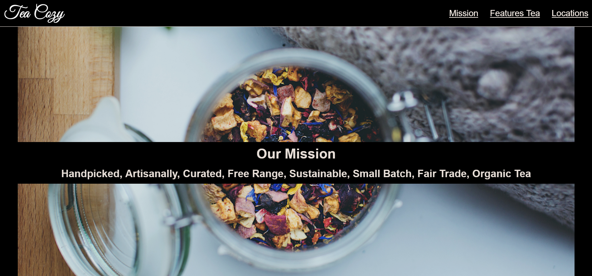

# Tea-cozy page (Front End Developer Course)

The page was created as part of the [Front End Developer Course by Orange DC](https://digitalcenter.orange.md/).

## Table of contents
- [Screenshot](#screenshot)
- [Links](#links)
- [The task and my comments](#the-task-and-my-comments)
- [Built with](#built-with)
- [Author](#author)

### Screenshot

### Links

[Tea-cozy page URL](#)

### The task and my comments

Create a web page that matches the sample page.

### Built with

- Semantic HTML5 markup;
- vanilla CSS;

### Author

[Andrei Martinenko](https://github.com/AxinitM)
